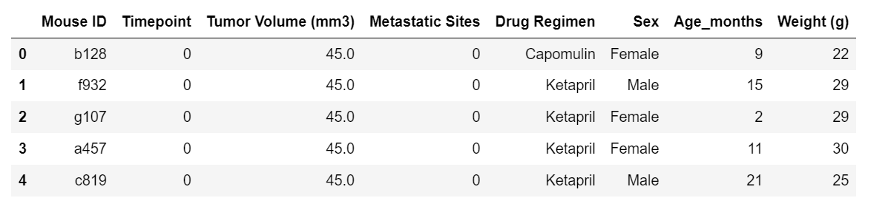

# python-matplotlib-challenge
 Pharmaceutical Company Data Analysis & Visualization

# PyCity Schools Analysis

### 1 Introduction 

- Here we have the datasets of pharmaceutical company that specializes in anti-cancer medication with some study results.

- Perfoming some different operations on the dataset, we found some important observations.

### 2  Observation Analysis

####  2.1 Summary Statistics

- Capomulin and Ramicane drugs have very low varience for overall tumor volume size in the summary dataset. So, these two drugs regimen ca be used for further detail analysis.

- Ketapril and Naftisol are the two most inconsistent drugs as show high varience. These should not consider the drugs 

#### 2.2 From Pie Chart

- The level of distribution for male and female mice is quite the same as shown in the pie plot.

#### 2.3 Boxplot

- Considering the boxplot for all the fours Dug Regimens, we found that the overall distribution of final tumor volume is less than 40 for Capomulin and Ramicane. 

- The other two medicines i.e Inubinol and Ceftmin has higher distribution for final tumor volume is higher than 60. 

#### 2.4 Correlation and Regression

- Normally, the average tumor volume is correspondence to the values of weight.

- The correlation between mouse weight and the average tumor volume is near to 1 i.e. only 0.84

